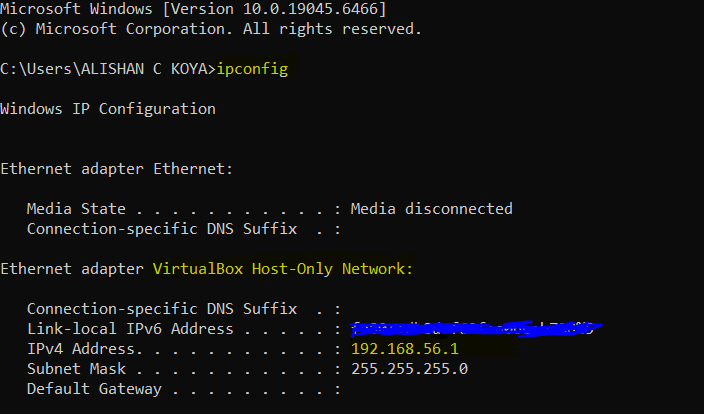
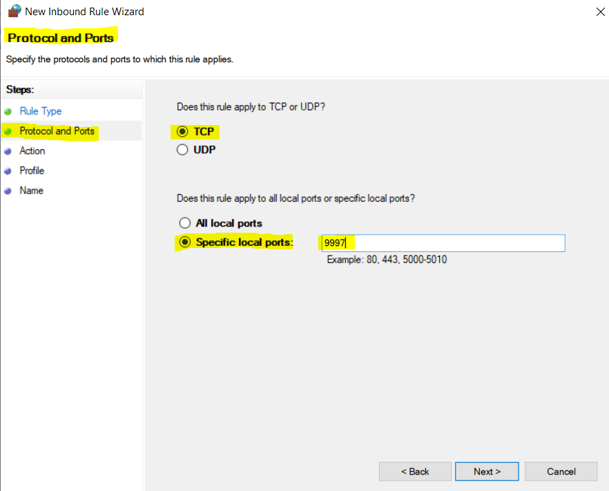
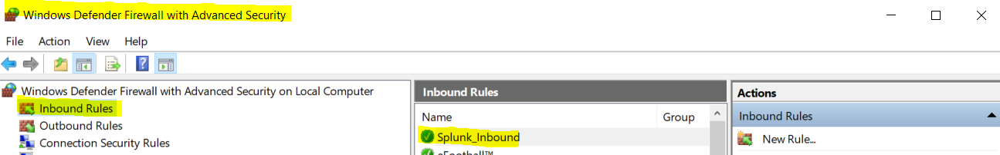
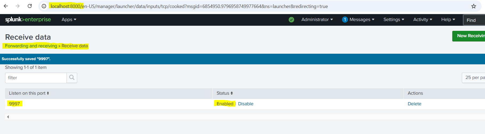
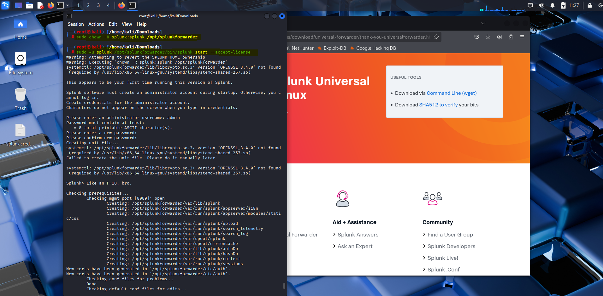
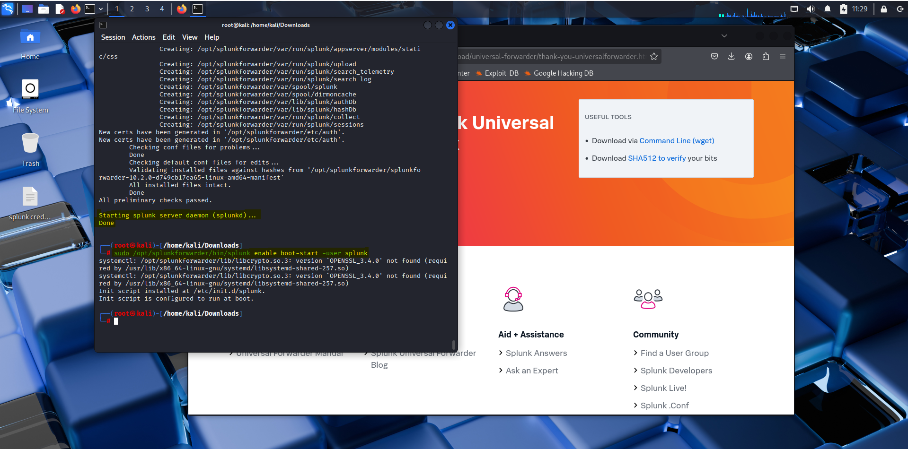
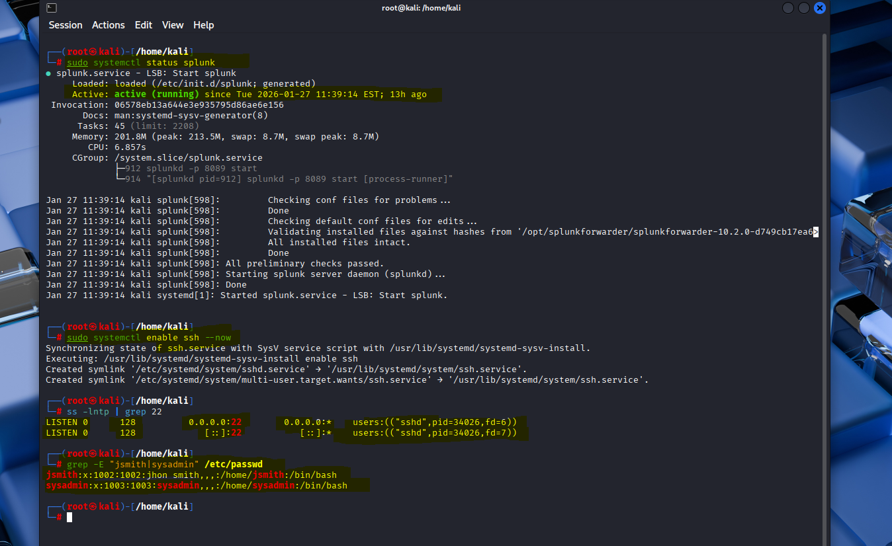
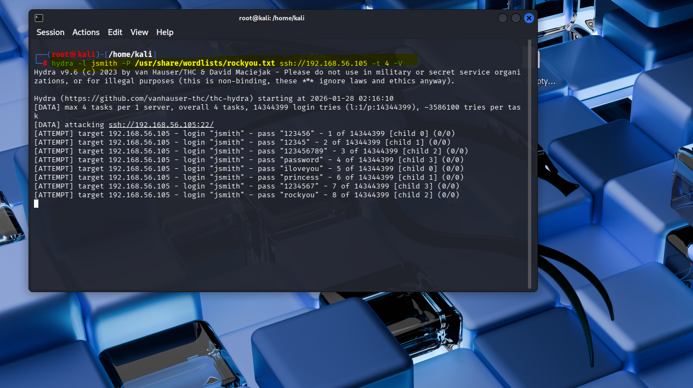
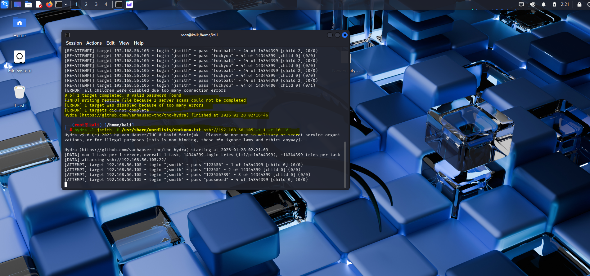
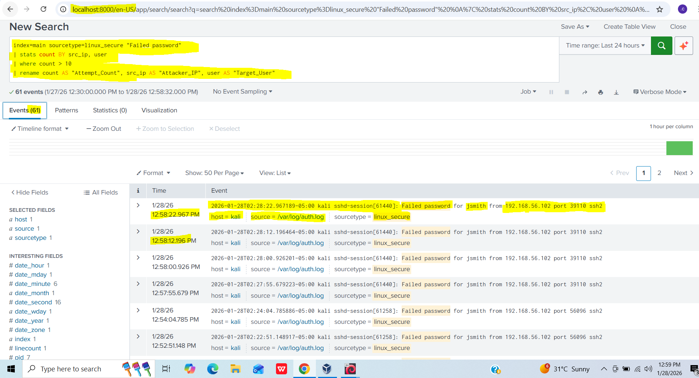

# 🛡️ Enterprise SIEM Lab: Adaptive Threat Detection & Pipeline Engineering

## 🎯 Project Overview
This lab documents the end-to-end deployment of a **Security Information and Event Management (SIEM)** pipeline. I engineered a telemetry bridge between a Linux production endpoint and a Windows-based Splunk Indexer. By simulating a coordinated SSH brute-force attack from an isolated **Attacker VM**, I validated the system's ability to detect, parse, and alert on **Credential Access (MITRE ATT&CK T1110)** threats in real-time.

---

## 🏗️ Technical Architecture
The environment utilizes a segmented virtual network to simulate enterprise-grade infrastructure:

* **Indexer/Search Head:** Splunk Enterprise on Windows 10.
* **Target Endpoint (Blue Team):** Kali Linux VM acting as a production server with a Splunk Universal Forwarder.
* **Attacker Host (Red Team):** Secondary Kali Linux VM on the same `192.168.56.0/24` subnet.
* **Telemetry Path:** Syslog ➔ `/var/log/auth.log` ➔ Universal Forwarder ➔ TCP/9997 ➔ Splunk Indexer.

*Figure 1: Validating the VirtualBox Host-Only Gateway at 192.168.56.1.*

---

## 🚀 Phase 1: Security Pipeline Engineering

### 1.1 Inbound Traffic Orchestration
To facilitate secure log ingestion, I opened a dedicated communication channel on the Windows Host. This prevents "silent failures" where logs are blocked by local host security policies.

*Figure 2: Configuring the Inbound Port Rule for TCP 9997.*

*Figure 3: Verification of the 'Splunk_Inbound' security rule.*

### 1.2 Ingestion Listener Configuration
I configured the Splunk Search Head as a centralized receiver, ensuring it is ready to index data the moment the forwarder connects.

*Figure 4: Active listening state for port 9997 in Splunk Enterprise.*

---

## 📡 Phase 2: Endpoint Telemetry Deployment

### 2.1 Universal Forwarder Ingestion
I deployed and optimized the Splunk Universal Forwarder on the target machine. This involved managing system-level ownership and resolving library dependencies to ensure high availability.

*Figure 5: Provisioning the Forwarder and establishing administrative control.*

### 2.2 Persistence & Log Tailing
To ensure no "blind spots," I enabled boot-start persistence and mapped the `/var/log/auth.log` and `/var/log/syslog` directories for continuous monitoring.

*Figure 6: Enabling 'boot-start' to maintain monitoring across system cycles.*

*Figure 7: Finalizing the handshake between the Kali Target and the Windows SIEM.*

---

## ⚔️ Phase 3: Red Team Simulation (Attack Scenario)

### 3.1 Service Auditing
Prior to exploitation, I audited the target's attack surface to confirm Port 22 (SSH) was exposed and that valid user accounts were present.

*Figure 8: Auditing active listeners and user identities (jsmith/sysadmin).*

### 3.2 Adaptive Brute-Force Exploitation
Using a separate Kali VM, I launched **THC-Hydra**. The initial "Loud Attack" triggered a service-level exhaustion error. I pivoted to a "Slow & Stealthy" tactic (`-t 1 -c 10`) to maintain connection stability while continuing the attempt.

*Figure 9: Launching the initial dictionary attack using the 'rockyou' wordlist.*

*Figure 10: Adapting the attack strategy after detecting target-side connection throttling.*

---

## 📊 Phase 4: Blue Team Analysis & Detection

Using custom **Search Processing Language (SPL)**, I converted raw unstructured logs into actionable security intelligence. The SIEM successfully flagged **61 failed login attempts** originating from the Attacker IP (`192.168.56.102`).

*Figure 11: Real-time detection of the brute-force incident in the Splunk Search UI.*

---

## 🛠️ Phase 5: Troubleshooting & Technical Hurdles

During the deployment, I encountered and resolved several critical errors that could have stalled the pipeline:

* **Dependency Resolution (`libcrypto.so.3`):** The Universal Forwarder failed to start due to a missing library link. I resolved this by manually symlinking the existing library to the version expected by Splunk.
* **Service Throttling:** During the attack phase, the target VM dropped connections due to `MaxStartups` limits in SSH. I diagnosed this via the Hydra error logs and adjusted the attack thread count to ensure log generation.
* **Log Access Permissions:** The Splunk user initially lacked read access to `/var/log/auth.log`. I implemented `setfacl` to grant the service the necessary read permissions without compromising system security.

---

## 💡 Remediation & Hardening Recommendations
1.  **Enforce Key-Based Authentication:** Disable password-based logins entirely.
2.  **Fail2Ban Deployment:** Automate IP blocking for addresses exceeding 5 failed attempts.
3.  **MFA Implementation:** Require a secondary token for all privileged SSH sessions.
